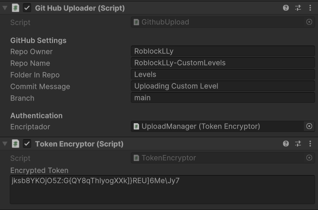

# RoblockLLy-CustomLevels

## Contribuidores
- Thomas Edward Bradley (16/06/2025)

## Información

Este presente repo continene los niveles personalizados, subidos a traves de la aplicación de extension para Android de RocblockLLy.  
  
El token usado para dicho proceso expira después de 90 días y tiene que ser actualizado. Para ello se debe generar un nuevo token que tiene permisos "repo" sobre este repositorio. 
Tras ello se debe abrir el proyecto Android en Unity y usar el "Upload Manager -> Token Encryptor" para encriptar el token y luego guardar este en el mismo sitio.  
  
El repositorio también se debe limpiar de vez en cuando para que no se sobresature con niveles.  
  
La configuración en el momento presente de la subida de los ficheros es el siguiente:  
